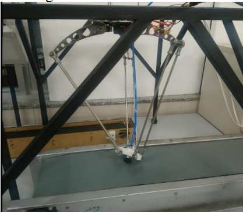
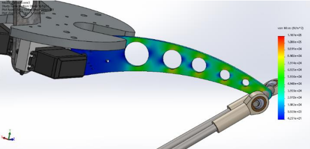
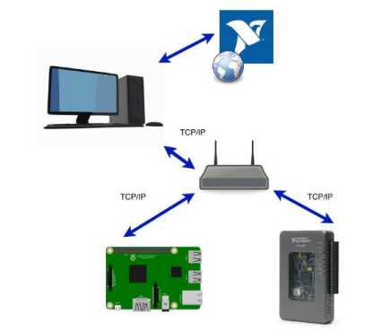

# Master main subject

**Design of a novel Parallel robot**

**Principal objectives of the work :**

- Maximize the **Dexterity** Generate continuous rotations
- Create a **Redundancy parallel robot**
- **Increase the Stiffness of the robot** 
- Optimize the geometrical parameters of the robots

<video src="../media/parallel_robots/master/compresion1_Trim.mp4" width="75%" controls autoplay loop></video>

Theoretical Part developed in progress of publication, finishing the 3D design model in order to advance and create the firs physical prototype.

# Projects Related to Parallel Robots

## Analysis of Redundancies in a Stewart Platform 

Performances study on the most resolute planar continuum robot with the largest range of actuation

<video src="../media/parallel_robots/first_prototype_tricept_Trim.mp4" width="75%" controls autoplay loop></video>

Research was conducted by Benjamin Mauzé during his PhD and showed the nanometric resolutions of the robot with a centimetric range.

## Design and Optimization of a Delta Robot

### General Design

Force sensing using compliant structures to link linearly the displacement and the force is particularly interesting, especially when combined with the high resolution allowed by periodic patterns pose sensing.

This method of highly resolute force sensing has notably been studied by Guelpa to provide a sensor with a range of 50 mN with a resolution of 5 nM.

### Optimization of the materials

More recently, Bhwanath Tiwari extended the degrees of freedom of force - displacement sensors by creating a compliant structure with embedding a **large range periodic pattern** to measure 3 DoF forces and torque with a nano-Newton resolution.

Example
[3] Tiwari, B., Blot, M., Laurent, G. J., Agnus, J., Sandoz, P., Lutz, P., & Clevy, C. T. (2021). **A High Range-to-Resolution Multi-axis Force and Torque Sensing Platform.** _IEEE/ASME Transactions on Mechatronics_. DOI [10.1109/TMECH.2021.3071444](https://doi.org/10.1109/TMECH.2021.3071444)

## Design of a Tricept Model 

<video src="../media/parallel_robots/first_prototype_tricept_Trim.mp4" width="75%" controls autoplay loop></video>

## Design of a Parallel Redundant Hand
<video src="../media/parallel_robots/stewart_gripper1_Trim.mp4" width="75%" controls autoplay loop></video>

# Analysis of Redundancies in Parallel Robots
<video src="../media/Stewart_platform/hexapo-sim2_Trim.mp4" width="75%" controls autoplay loop></video>

## High resolution alignment
# Bio=Inspired Control Systems

# Trading with Reinforcenment learning

## Performances

This method was tested through both simulations and experimentations and **performances of pose measurement resolutions** can be summarized as follow:

| Axis     | Resolution    | Range of measure |
| -------- | ------------- | ---------------- |
| $x$      | 1 nm          | 11.6 cm          |
| $y$      | 1 nm          | 11.6 cm          |
| $z$      | < 0.1 mm      | /                |
| $\alpha$ | 4.1 $\mu$rad. | $2\pi$ rad.      |
| $\beta$  | 120 $\mu$rad. | $\pi/8$ rad.     |
| $\gamma$ | 118 $\mu$rad. | $\pi/8$ rad.     |

# Planning of a Robot with ROS
In tihs section is presented

# Radio frecuency Systems
In this section is presented

