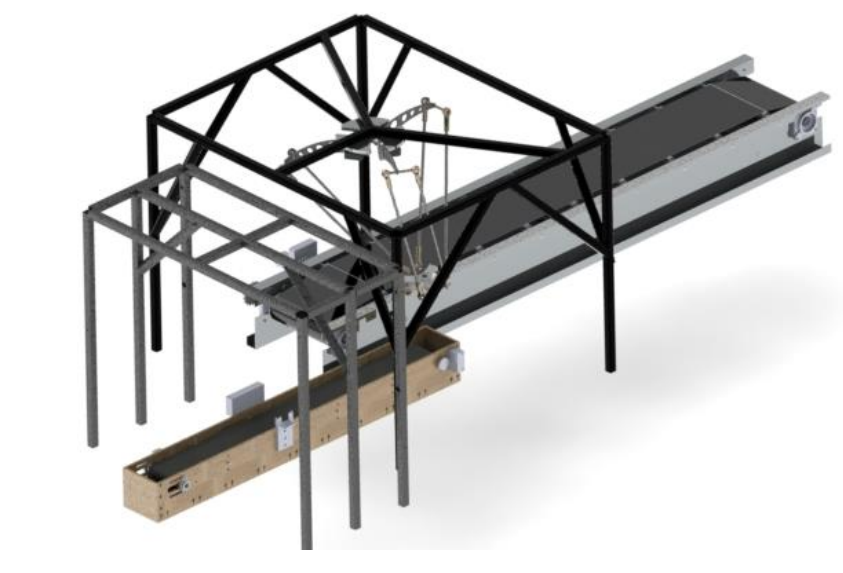
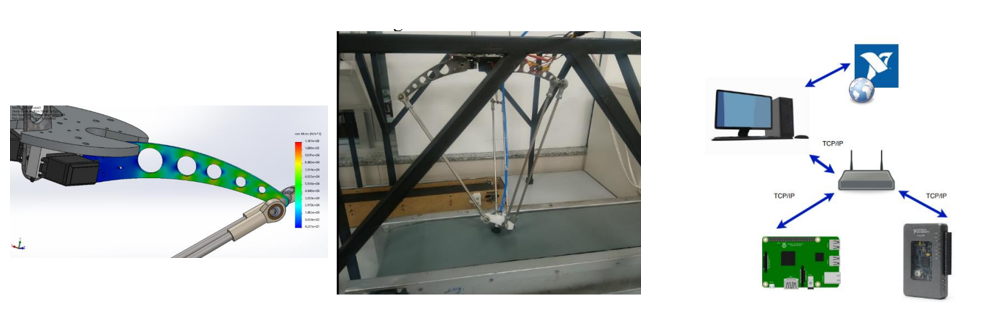
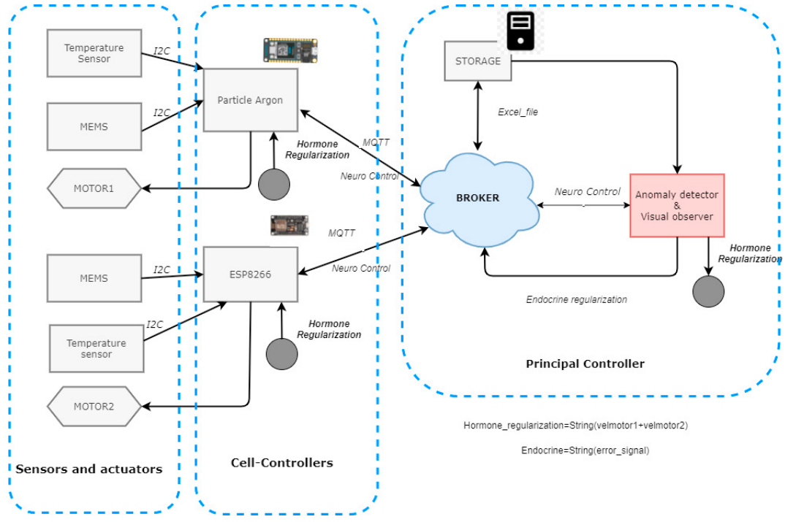
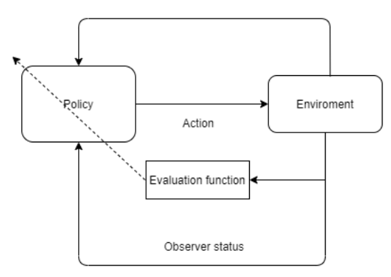
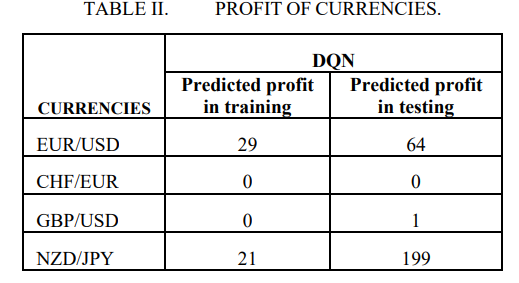
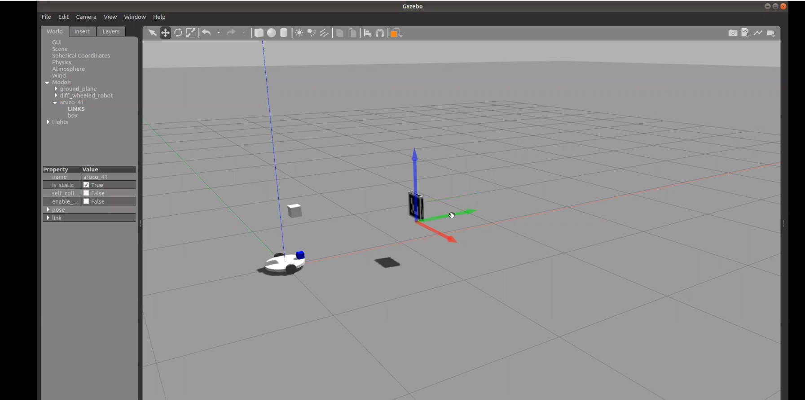
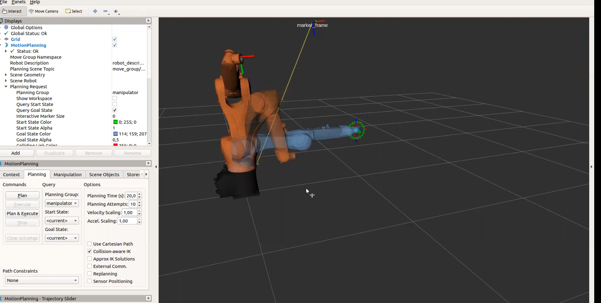
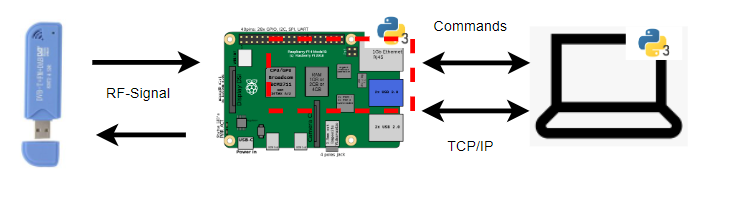
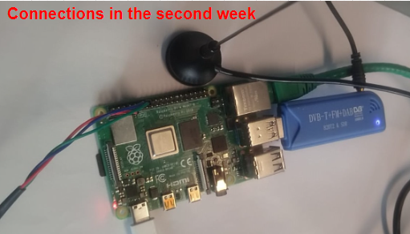

# Master main subject

**Design of a novel Parallel robot**

**Principal objectives of the work :**

- Maximize the **Dexterity** Generate continuous rotations
- Create a **Redundancy parallel robot**
- **Increase the Stiffness of the robot** 
- Optimize the geometrical parameters of the robots

<video src="../media/parallel_robots/master/compresion1_Trim.mp4" width="75%" controls autoplay loop></video>

Theoretical Part developed in progress of publication, finishing the 3D design model in order to advance and create the first physical prototype, the previous video shows the simulation of the robot in the software Solidworks, the link of the publication will be attached in the future.

# Projects Related to Parallel Robots

## Analysis of Redundancies in a Stewart Platform 

Inthis work is analyzed the **Stewart Platform** and the **Redundancies** that this platform has, in order to create a new parallel robot with the same characteristics of the Stewart Platform, but with a **higher stiffness** and **higher dexterity**, one of the main characteristics of this platform is that it has **three degrees of freedom** and **three redundant degrees of freedom**. Below is a video of the simulation of the Stewart Platform in the software Matlab with the **inverse kinematics** of the platform + 1 redundant degree of freedom.
<video src="../media/Stewart_platform/hexapo-sim2_Trim.mp4" width="75%" controls autoplay loop></video>

Additionally the code and report is available in the following github link [Report](https://github.com/GroverAruquipa/Redundant_stewart_platform) [Code](https://github.com/GroverAruquipa/Redundant_stewart_platform). 

## Design and Optimization of a Delta Robot

This work contemplates the analysis, design, operation and manufacturing of a collection and packaging system. This work seeks to perform a decentralized control between a RaspBerry pi, a $fpga$ and an ARM controller. Taking as main reference a Delta Robot.

### General Design

In this work, was analyzed a manufacturer system, based in a Delta Robot. Therefore, It's possible to observe in the following figure how the system is developed, finding the inverse kinematics of the delta robot, the belt conveyors and a decentralized system.

In the following figure, it's observed the CAE analysis of the arm of the Delta Robot, where the main parameters are analyzed, such as the **stiffness**, **dexterity** and **redundancy** of the system. Additionally, its observed the full system manufactured in the laboratory.

The full explanation and results of this system is presented in the following publication:

[1] Aruquipa G. , Rojas G. (2021). **Design and Implementation of a Delta Robot Based on FPGA for the Automation of the Collection of Solid Products.** _IEEE/ICIEAM_. DOI [10.1109/ICIEAM51226.2021.9446417](https://doi.org/10.1109/ICIEAM51226.2021.9446417.)
### Optimization of the materials

Additionally, We were focused on the construction of the Delta Robot, where we optimized the materials in order to increase the stiffness and reduce the weight of the robot, therefore in the following publication is presented the results of the optimization of the materials in order to build the Delta Robot.

[2] Aruquipa G. , Rojas G. (2021). **Design And Manufacture of A Delta Type Parallel Robot from the Study of Materials.** _IEEE/ICMIMT_. DOI [10.1109/TMECH.2021.3071444](https://doi.org/10.1109/ICMIMT52186.2021.9476134)

## Design of a Tricept Parallel Robot 
In order to analyze the parallel robots with redundancies, the parallel tricept model was analyzed, where the inverse kinematics was analyzed and the simulation was performed in the software Solidworks. The following video shows the simulation of the robot in the software Solidworks, in order to understand the inverse kinematics of the robot.vased in prismatic joints.
<video src="../media/parallel_robots/first_prototype_tricept_Trim.mp4" width="75%" controls autoplay loop></video>

This model was designed following the publication of the following link [Tricep_model](https://www.researchgate.net/publication/2281005_A_New_Tricept-Like_Robot_with_Three_Prismatic_Joints_and_Three_Rotational_Joints). 
And the grabcad repository is available in the following link [3DTricept](https://grabcad.com/library/first-tricept-model-1).

## Design of a Parallel Redundant Hand based in the Stewart Platform
In order to apply the method **TRIZ**, which is well explained in the following link [TRIZ](https://www.triz-journal.com/), in order to create a new parallel robot, the **Stewart Platform** was analyzed, where the **redundancies** of the platform were analyzed, therefore designing an innovation process in order create a robotic hand with the same characteristics of the Stewart Platform, but with a **higher stiffness** and **higher dexterity**. The following video shows the simulation of the robot in the software Solidworks.

<video src="../media/parallel_robots/stewart_gripper1_Trim.mp4" width="75%" controls autoplay loop></video>

For this project the full Report is available in the following link [Report](https://github.com/GroverAruquipa/Innovation2) and the model designed in the software Solidworks is available in the following link [3D_parallel_ Hand_Model](https://grabcad.com/library/stewart-manipulator-1).

# Bio Inspired Control Systems
## An IoT architecture based on the control of Bio Inspired manufacturing system for the detection of anomalies with vibration sensors
In this work is implemented an Iot architecture based on the control of a Bio Inspired manufacturing system, where the vibration sensors are used to detect anomalies in the system. The following figure shows the architecture of the system, where the vibration sensors are used to detect the anomalies in the system, and the Raspberry pi is used to control the system, the architectures observed below:

This architecture was implemented in order to observe the vibration parameters of a DC motor in a belt conveyor, using the vibration sensors, as feedback in the descentrealized control system. The foll work is based on the following publication:

[3] Aruquipa G. , Diaz G. (2022). **An IoT architecture based on the control of Bio Inspired manufacturing system for the detection of anomalies with vibration sensors.** _Procedia Computer Science_. DOI [10.1016/j.procs.2022.01.242](https://doi.org/10.1016/j.procs.2022.01.242)

# Trading with Reinforcement learning

This work shows an implementation of Deep
reinforcement learning in currency pairs for the FOREX
currency market, using deep learning techniques combined with
reinforced learning, profit is obtained using databases extracted
from recent years, the results found are analyzed, such as the loss
function, compensation and behavior. Of the system.

In the following table, It's possible to observe the results of the trading system, where the **reward** is the profit obtained in the trading system, and the **loss** is the loss obtained in the trading system. Therefore, its presented an algorithm working in a stochastic behavioral.

Finally, the results are presented in the following publication:

[4] Aruquipa G. , Rojas G. (2021). **Analysis of Algorithmic Trading with Q-Learning in the Forex Market.** _IEEE_. DOI [10.1109/ESCI50559.2021.9396948](https://doi.org/10.1109/ESCI50559.2021.9396948)

## Tube Concentric Robots

In this project, a deformable robot called Tube concentric Robot was explored, where the direct kinematics and a simulation carried out in Matalb were analyzed, which validates this step. The following video shows the simulation of the robot in the software Matlab, in order to understand the direct kinematics of the robot.

<video src="../media/Tube_concentric/tube_Trim.mp4" width="75%" controls autoplay loop></video>

Additionally the parameters of the robot were analyzed, where the following table shows the parameters of the robot, where the **t** is the thickness of the tube, the **c** is the curvature of the tube and the **d** is the distance between the tubes.

The **parameter for the simulation of the tube concentric Robot** can be summarized as follows:

| Number Tube     | t    | c | d |
| -------- | ------------- | ---------------- | ---------------- |
| $Tube_1$      | 0.6123 $\mu$m          | 13.94          | 0.12 m          |
| $Tube_ 2$      | 0.6123 $\mu$m          | 11.02           | 0.155 m          |
| $Tube_3$      | 0.6123 $\mu$m      | 11.02                |  0.12 m        |

In this way the implemented code is abvailable in the following link [Tube_concentric](https://github.com/GroverAruquipa/Micro_robotics_TPs) and the full report is available in the following link [Report](https://github.com/GroverAruquipa/Microrobotics_tp22)

# Planning of a KUKA Robot with ROS
This work is an implementation of a KUKA robot with ROS, using the package **kuka_experimental**, where the robot is controlled with the package **moveit**. The following video shows the simulation of the robot in the software Gazebo, where is possible to understand the inverse kinematics of the robot. 

Additionally, is used pytorch in order to use **YOLO** in order to detect the objects in the environment, where the following image shows the simulation of the robot in the software Gazebo, the interest3ing part is the detection of the objects in the environment and the planning of the robot in order to avoid the objects. And follow the center of the object.

The full code is available in the following link [KUKA_ROS](https://github.com/GroverAruquipa/kuka_ros_yolo), where is presented different packages of the robot, based on the **kuka_experimental** package.

# Radio frequency Systems

This project presents an application of the GNU Radio, in order to characterize the radio frecuency systems, using the Raspberry Pi 4, and the communication between the Raspberry Pi 4 and the PC, using sockets in order to run an external interface developed using **Tkinter**. The following video shows the simulation of the robot in the software Gazebo, where is possible to understand the inverse kinematics of the robot.
<video src="../media/GNU_Radio/GNU1_Trim.mp4" width="75%" controls autoplay loop></video>

The following image shows the communication between the Raspberry Pi 4 and the PC, where the Raspberry Pi 4 is used to control the GNU Radio, and the PC is used to control the external interface developed using **Tkinter**.

In this way, the final report and the implemented codes is available in the following link [frequency](https://github.com/GroverAruquipa/PROJECT_M1_Report) , by this way this project was developed, based in the work presented in the following link [Report](http://jmfriedt.free.fr/) where is available the instructions to implement the project.
